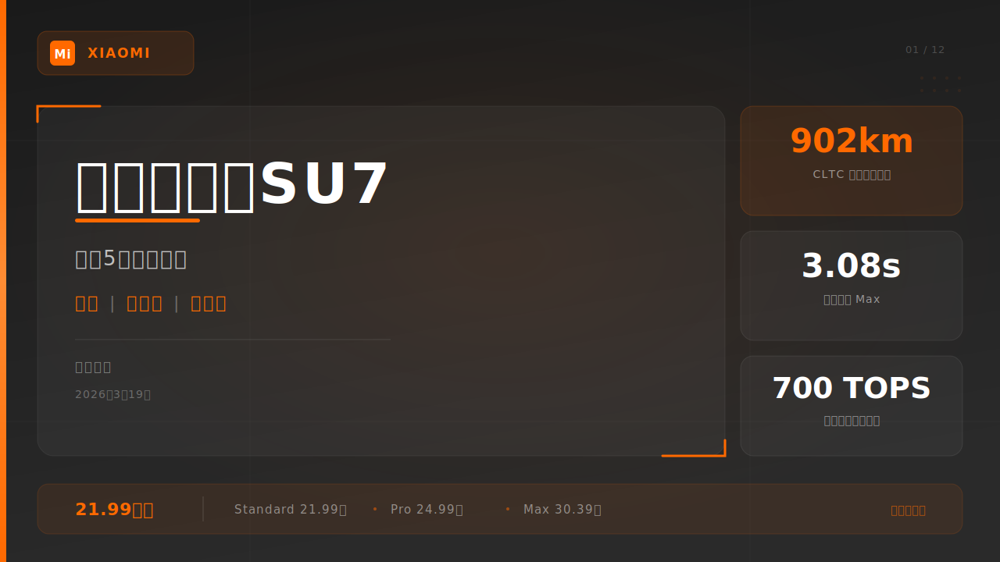
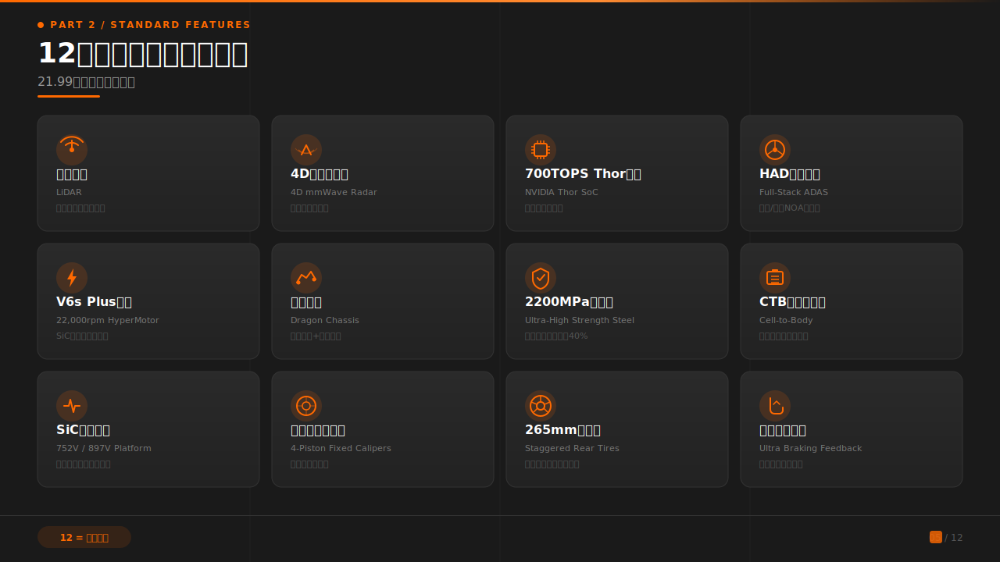
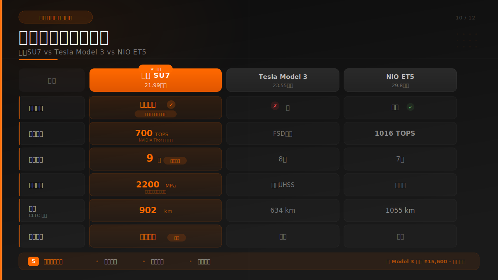

# PPT Agent 深度研究：多智能体协作驱动的演示文稿生成系统

> 一个将认知科学、设计系统、多模型验证和工程化工作流融为一体的 Claude Code 插件

---

## 摘要

**ppt-agent** 是一个基于 Claude Code 插件架构的多智能体幻灯片生成系统。它将演示文稿创建拆解为 7 个阶段、4 个专业智能体，通过星型拓扑协调，输出 SVG 1280×720 格式的 Bento Grid 布局幻灯片，并采用 Claude + Gemini 双模型交叉验证确保质量。

本文从架构设计、设计系统、质量保障、竞品对比四个维度对该项目进行深度剖析，评估其在 AI 演示文稿生成赛道中的独特定位和改进方向。

**关键数字**：4 个智能体 | 7 个阶段 | 3 个硬停止点 | 10 种布局 | 5 维评分 | 2,778 行代码

---

## 目录

1. [行业背景](#1-行业背景)
2. [项目概述](#2-项目概述)
3. [多智能体架构](#3-多智能体架构)
4. [七阶段工作流](#4-七阶段工作流)
5. [实战案例：小米 SU7 发布会](#5-实战案例小米-su7-发布会)
6. [设计系统](#6-设计系统)
7. [质量保障体系](#7-质量保障体系)
8. [数据纵览](#8-数据纵览)
9. [竞品对比](#9-竞品对比)
10. [改进建议](#10-改进建议)
11. [总结](#11-总结)

---

## 1. 行业背景

AI 演示文稿生成在 2025-2026 年经历了爆发式增长，形成了三个清晰的梯队：

| 梯队 | 代表产品 | 特点 |
|------|---------|------|
| **SaaS 平台** | Plus AI, SlidesAI, Alai, Gamma | 云端 WYSIWYG，模板驱动，低门槛 |
| **开源框架** | PPTAgent/DeepPresenter (ICIP-CAS) | 参考幻灯片分析，编辑操作生成，研究导向 |
| **CLI 工作流** | ppt-agent（本仓库） | Claude Code 插件，多智能体，SVG 原生，开发者导向 |

值得注意的趋势是：2025 年 3 月 Tome 宣布关闭幻灯片产品，说明"一键生成"模式在质量和差异化上遇到了瓶颈。而 PPTAgent V2（2025 年 12 月）引入深度研究、沙箱环境和 20+ 工具，预示着行业正从"简单生成"走向"智能体工作流"。

ppt-agent 正是在这一背景下出现的：它不追求"一键生成"的便利性，而是追求**结构化、可控、可验证**的生成质量。

---

## 2. 项目概述

### 技术画像

| 指标 | 数值 |
|------|------|
| 项目类型 | Claude Code 插件 |
| 版本 | 1.0.0 |
| 总代码量 | 2,778 行 / 105KB |
| 文件数 | 23 |
| 主要语言 | Markdown (56.5%), YAML, TypeScript, HTML, JSON |
| 输出格式 | SVG 1280×720 |
| 设计范式 | Bento Grid 布局 |
| 质量保障 | Claude + Gemini 双模型审查 |

### 核心理念

ppt-agent 的设计哲学可以用三个"不是"概括：

1. **不是取代设计师**——而是为技术用户提供结构化、可控的演示文稿生成能力
2. **不是黑盒生成**——而是人机协作工作流，用户在 3 个关键节点保持决策控制
3. **不是单一模型**——而是多智能体分工 + 双模型交叉验证

---

## 3. 多智能体架构


### 星型拓扑设计

ppt-agent 采用**星型拓扑**——主编排器（Lead Orchestrator）居中，4 个专业智能体仅与 Lead 通信，不直接互通：

| 智能体 | 模型 | 职责 | Max Turns |
|--------|------|------|-----------|
| **Research Core** | Sonnet | 需求调研 + 素材收集 | 20 |
| **Content Core** | Opus | 大纲规划 + 规划草稿 | 25 |
| **Slide Core** | Opus | Bento Grid SVG 设计 | 30 |
| **Review Core** | Sonnet | 质量审查（Gemini 驱动） | 15 |

**模型选型逻辑**：将最强模型（Opus）分配给需要深层结构化思维（大纲）和精确空间推理（SVG 生成）的任务；将高性价比模型（Sonnet）分配给信息检索（研究）和流程协调（审查）任务。

### 通信协议

所有智能体通过 `SendMessage` 信号与 Lead 通信，共 10 种独立信号类型：

- **通用信号**：`heartbeat`（存活确认）、`error`（失败报告）
- **研究信号**：`research_ready`、`collection_ready`
- **内容信号**：`outline_ready`、`draft_slide_ready(index=N)`、`draft_complete`
- **设计信号**：`slide_ready`、`slide_fixed`
- **审查信号**：`review_passed`、`review_failed`

其中 `draft_slide_ready(index=N)` 是管道化优化的关键——它使 Phase 6 无需等待所有草稿完成即可启动设计。

### 为什么是星型而非网状？

| 拓扑 | 通信复杂度 | 适用规模 | 可观测性 |
|------|-----------|---------|---------|
| 星型 | O(N) | 2-8 智能体 | 高（单点审计） |
| 全连接 | O(N²) | 2-4 智能体 | 低（分散） |
| 分层 | O(N log N) | 8+ 智能体 | 中 |

对于 4 智能体规模，星型拓扑是最优选择——通信简单、故障隔离、天然可审计。

---

## 4. 七阶段工作流


### 阶段概览

| 阶段 | 名称 | 硬停止 | 主要智能体 | 核心产出 |
|------|------|--------|-----------|---------|
| 1 | Init | — | Lead | run_dir, proposal.md |
| 2 | 需求调研 | **YES** | Research Core | research-context.md, requirements.md |
| 3 | 素材收集 | — | Research Core ×N | materials.md |
| 4 | 大纲规划 | **YES** | Content Core | outline.json |
| 5 | 规划草稿 | — | Content Core | drafts/slide-{nn}.svg |
| 6 | 设计+审查 | — | Slide Core + Review Core | slides/ + reviews/ |
| 7 | 交付 | **YES** | Lead | output/*.svg + index.html |

### 硬停止点的意义

3 个硬停止点（Phase 2, 4, 7）是 ppt-agent 区别于"一键生成"工具的核心设计：

- **Phase 2 硬停止**：确认目标受众、核心信息、语气风格——避免"方向错误地高效执行"
- **Phase 4 硬停止**：展示数字便签纸风格的大纲预览，用户可调整结构——避免"在错误框架上精雕细琢"
- **Phase 7 硬停止**：最终交付前的浏览器预览——给用户最后的审查机会

### 管道化优化（Phase 5→6）

传统做法是等所有草稿完成后才开始设计。ppt-agent 的创新在于：

```
Phase 5                          Phase 6
Content Core                     Slide Core + Review Core
┌─────────────┐                  ┌──────────────────────┐
│ 草稿 Slide 1│─signal──────────→│ 设计 Slide 1→审查    │
│ 草稿 Slide 2│─signal──────────→│ 设计 Slide 2→审查    │
│ 草稿 Slide 3│─signal──────────→│ 设计 Slide 3→审查    │
│ ...         │  (管道化)         │ (滑动窗口 W=3)       │
└─────────────┘                  └──────────────────────┘
```

滑动窗口限制为 `min(3, remaining_slides)`，防止并行智能体过多消耗资源。

### 文件流转关系

```
input.md ──→ proposal.md ──→ tasks.md
                ↓
research-context.md ──→ requirements.md ──→ materials.md
                                              ↓
                              outline.json ──→ outline-preview.md
                                   ↓
                         drafts/slide-{nn}.svg
                                   ↓
                         slides/slide-{nn}.svg ←→ reviews/review-{nn}.md
                                   ↓                     ↓
                         output/slide-{nn}.svg    reviews/review-holistic.md
                         output/index.html
                         speaker-notes.md
```

---

## 5. 实战案例：小米 SU7 发布会

理论和架构分析之后，让我们看看 ppt-agent 的真实输出。以下是使用 ppt-agent 生成的**小米 SU7 新品发布会**完整 12 张幻灯片中的代表作。

### 封面页（Slide 01）



**设计亮点**：
- **Bento Grid 布局**：左侧主标题卡片 + 右侧 3 个规格亮点卡片（902km / 3.08s / 700 TOPS）
- **品牌一致性**：小米标志性橙色（#FF6900）贯穿全局
- **视觉层次**：72px 主标题 → 26px 副标题 → 22px 关键词 → 16px 元信息，4 层递进
- **底部价格带**：21.99万起，Standard / Pro / Max 三档清晰列出
- **深色主题**：科技感深灰背景，橙色渐变作为强调

### 全系标配配置页（Slide 05）



**设计亮点**：
- **4×3 Bento Grid**：12 张功能卡片均匀分布，每张含图标+标题+英文名+一句话说明
- **图标系统**：全部使用 SVG path 手绘图标（雷达、芯片、闪电、盾牌等），风格统一
- **信息密度控制**：每张卡片严格控制在 3 个信息元素（图标、名称、说明），符合 Miller 定律
- **视觉节奏**：卡片间距 16px，圆角 12px，统一的微妙阴影和边框

### 竞品对比页（Slide 10）



**设计亮点**：
- **数据可视化表格**：6 行×4 列对比（SU7 vs Tesla Model 3 vs NIO ET5）
- **视觉引导**：SU7 列加宽（340px vs 290px）+ 橙色渐变高亮，形成视觉焦点
- **胜出标记**：橙色 ✓ + "同价位首次" / "同级最多" / "独家" 徽章
- **底部汇总条**："5 项领先或持平 · 价格最低 · 配置最全 · 安全最强"

### 全套 12 张幻灯片

完整的 12 张幻灯片（SVG 源文件）存放在 `images/xiaomi-su7-samples/` 目录：

| 编号 | 内容 | 页面类型 | 大小 |
|------|------|---------|------|
| slide-01 | 封面：新一代小米SU7 | cover | 11.5 KB |
| slide-02 | 研发历程：造车5年 | content | 13.6 KB |
| slide-03 | 动力系统详解 | data | 17.8 KB |
| slide-04 | 智能驾驶系统 | content | 15.1 KB |
| slide-05 | 12项旗舰标配 | dashboard | 19.9 KB |
| slide-06 | 安全体系 | content | 13.1 KB |
| slide-07 | 电池与续航 | data | 23.8 KB |
| slide-08 | 智能座舱 | content | 24.4 KB |
| slide-09 | 设计语言 | content | 17.2 KB |
| slide-10 | 竞品对比 | comparison | 26.1 KB |
| slide-11 | 销售策略 | content | 21.6 KB |
| slide-12 | 谢幕页 | cover | 12.1 KB |

**总计**：12 张幻灯片，216 KB SVG 源码，全部通过 Bento Grid 布局 + 小米品牌橙色风格一致呈现。

---

## 6. 设计系统

### Bento Grid 布局

Bento Grid（便当盒布局）是由 Apple 产品发布会推广的模块化设计方式，将内容组织在视觉上独立但逻辑上关联的"卡片"中。

ppt-agent 定义了 10 种布局组合：

| 布局 | 适用场景 | 信息容量 |
|------|---------|---------|
| single_focus | 封面、引言、金句 | 1-3 单元 |
| 2-column symmetric | 对比分析 | 4-6 单元 |
| 2-column asymmetric | 图文混排 | 3-5 单元 |
| 3-column | 多特性并列 | 4-6 单元 |
| hero+grid | 主视觉+细节 | 4-7 单元 |
| mixed | 灵活内容 | 3-5 单元 |
| timeline | 时间线/流程 | 3-6 单元 |
| dashboard | 数据仪表盘 | 4-7 单元 |
| horizontal split | 上下分区 | 3-5 单元 |
| full-bleed | 全出血背景 | 1-2 单元 |

### 风格令牌系统

4 种预设风格，通过 YAML 配置文件定义完整的设计令牌：

| 风格 | 情绪 | 主色 | 强调色 | 适用场景 |
|------|------|------|--------|---------|
| **Business** | 权威、可信 | #1a365d 深蓝 | #e67e22 暖橙 | 企业报告、投资者演讲 |
| **Tech** | 创新、前瞻 | #0f172a 深灰 | #6366f1 靛蓝 | 科技演讲、产品发布 |
| **Creative** | 活力、表现 | #1a1a2e 深紫 | #7c3aed 紫色 | 设计演讲、营销提案 |
| **Minimal** | 宁静、聚焦 | #18181b 近黑 | #3b82f6 蓝色 | 主题演讲、学术演讲 |

每种风格包含 7 层令牌：color_scheme、typography、card_style、gradients、elevation、decoration、slide_type_overrides。

### 认知科学基础

ppt-agent 将以下认知科学原理编码为设计约束：

| 原理 | 应用 | 约束 |
|------|------|------|
| **Miller 定律** | 工作记忆容量 7±2 | 每张幻灯片 ≤5 信息单元 |
| **Mayer 多媒体原理** | 图文并茂优于纯文本 | 鼓励多模态呈现 |
| **Gestalt 接近律** | 空间邻近暗示关联 | Bento Grid 卡片分组 |
| **三秒测试** | 核心信息应在 3 秒内传达 | 视觉层次三层模型 |
| **认知负荷理论** | 减少外在负荷 | 统一风格令牌 |

---

## 7. 质量保障体系


### 双环路审查

```
生成环路 (Claude Opus)              审查环路 (Gemini / Claude Sonnet)
┌───────────────┐                  ┌───────────────────┐
│ 读取大纲+草稿  │                  │ 预检自动化检查     │
│ 应用风格令牌   │                  │ (XML/ViewBox/Font) │
│ 生成 Bento SVG│── slide_ready ─→│ Gemini 视觉审查    │
│ 自动验证      │                  │ 5 维评分           │
│ (xmllint 等)  │← fixes_json  ──│ 结构化修复建议      │
└───────────────┘                  └───────────────────┘
```

### 五维加权评分模型

| 维度 | 权重 | 硬门控 | 评估内容 |
|------|------|--------|---------|
| Layout Balance | 25% | ≥ 6 | 空间分配均衡性 |
| Readability | 25% | ≥ 6 | 文字可读性和层次 |
| Typography | 20% | — | 字体选择和排版规范 |
| Information Density | 20% | — | 信息密度合理性 |
| Color Harmony | 10% | — | 色彩搭配和谐度 |

**通过条件**：加权总分 ≥ 7.0 且两个硬门控均 ≥ 6

### 自适应修复策略

系统根据初始评分动态调整修复预算：

| 分数区间 | 策略 | 理由 |
|---------|------|------|
| ≥ 7.0 | 直接通过 | 质量达标 |
| 5.0 - 6.9 | 最多 2 轮修复 | 有改善空间，值得投入 |
| 3.0 - 4.9 | 最多 1 轮修复 | 问题较多，有限改善 |
| < 3.0 | 从头重新生成 | 修复成本高于重建 |

这种策略避免了"在低质量基础上反复修补"的无效循环。

### 自动化预检

在 LLM 审查之前，系统运行 5 项自动化检查：

1. **XML 有效性** (Critical)：`xmllint --noout` 验证
2. **ViewBox 存在** (Critical)：必须为 `viewBox="0 0 1280 720"`
3. **字体大小合规** (Major)：正文 ≥ 14px，标签 ≥ 12px
4. **颜色令牌合规** (Warning)：使用的颜色应来自风格文件
5. **安全区域** (Major)：内容不超出 60px 内边距

如果 Critical 级别检查失败，直接返回自动失败，不进入 LLM 审查——节省 API 成本。

---

## 8. 数据纵览

### 代码结构分布

| 模块 | 行数 | 占比 | 说明 |
|------|------|------|------|
| 提示词系统 | 698 | 25.1% | 项目知识密度最高的部分 |
| HTML 预览模板 | 528 | 19.0% | 交互式 3 模式预览 |
| Gemini 审查技能 | 510 | 18.4% | 脚本+角色+技能定义 |
| 智能体定义 | 335 | 12.1% | 4 个专业智能体 |
| 主编排命令 | 261 | 9.4% | 7 阶段工作流编排 |
| 风格令牌 | 206 | 7.4% | 4 种预设风格 |
| 文档/配置 | 240 | 8.6% | CLAUDE.md + README + 配置 |

**Markdown 占文件总数的 56.5%**——这是一个"文档即代码"的项目，智能体行为通过结构化 Markdown 而非传统编程语言定义。

### 系统参数一览

| 参数 | 值 |
|------|-----|
| SVG 画布 | 1280×720 |
| 安全区域 | 60px 内边距 |
| 通过阈值 | 7.0/10 |
| 最大修复轮数 | 2 |
| 管道窗口 | 3 |
| 布局类型 | 10 种 |
| 风格预设 | 4 种 |
| 评分维度 | 5 个 |
| 信号类型 | 10 个 |
| 预检项 | 5 个 |
| Gemini 回退层级 | 3 级 |
| 硬停止点 | 3 个 |

---

## 9. 竞品对比

### 核心方法论差异

| 维度 | ppt-agent | PPTAgent V2 (ICIP-CAS) | SaaS 平台 |
|------|-----------|------------------------|----------|
| **生成范式** | 原理驱动（认知科学+设计系统） | 参考学习（从现有 PPT 提取模式） | 模板填充 |
| **输出格式** | SVG | PPTX | PPTX / Web |
| **质量保障** | 双模型交叉验证 | 反思式生成 | 模板约束 |
| **用户参与** | 3 个硬停止点 | 低交互 | WYSIWYG 实时编辑 |
| **定制深度** | 完全可定制 | 中等 | 模板范围内 |
| **部署方式** | 本地 CLI | 本地 Python | 云端 |

### 竞争力评估

| 维度 | ppt-agent | SaaS 平台 | 说明 |
|------|-----------|----------|------|
| 定制能力 | ★★★★★ | ★★☆☆☆ | ppt-agent 可修改 prompt、风格、布局 |
| 数据隐私 | ★★★★☆ | ★★☆☆☆ | 本地处理，API 调用可控 |
| 设计质量 | ★★★★☆ | ★★★★☆ | 认知科学 vs 专业模板 |
| 工程化 | ★★★★☆ | ★★★☆☆ | Git 友好、版本控制 |
| 易用性 | ★★☆☆☆ | ★★★★★ | CLI vs WYSIWYG |
| 格式兼容 | ★★☆☆☆ | ★★★★★ | SVG vs PPTX |
| 生态集成 | ★★★★☆ | ★★★☆☆ | Claude Code 插件生态 |

---

## 10. 改进建议

### 短期（1-2 周）

1. **添加 outline.json 的 JSON Schema 验证**——这是工作流的枢纽文件，格式错误会导致级联失败
2. **为 invoke-gemini-ppt.ts 添加单元测试**——回退逻辑是关键路径，不应仅靠运行时验证
3. **补充 package.json 依赖声明**——改善可移植性和新用户上手体验
4. **添加 SVG 样本输出**——降低新用户理解门槛

### 中期（1-2 月）

5. **SVG → PPTX 转换管道**——通过 LibreOffice 或 python-pptx，扩大用户群
6. **提示词回归测试**——固定输入检查输出结构一致性，防止 prompt 修改引入退化
7. **扩展风格库**——教育、医疗、金融等垂直场景
8. **图片资产集成**——占位图或 AI 生成配图

### 长期（3-6 月）

9. **用户风格学习**——从用户历史 PPT 中提取设计偏好
10. **VS Code 扩展**——实时预览+编辑，降低使用门槛
11. **演讲排练模式**——语音+计时+反馈，完善演讲辅助闭环

---

## 11. 总结

### SWOT 分析

| | 正面 | 负面 |
|---|------|------|
| **内部** | 精心设计的多智能体架构、双模型质量保障、认知科学驱动的设计系统 | SVG 格式兼容性、无测试覆盖、Gemini 依赖脆弱 |
| **外部** | Claude Code 生态增长、AI 演示赛道爆发 | SaaS 竞品资金充裕、PPTX 格式壁垒 |

### 成熟度评级

| 维度 | 评分 |
|------|------|
| 架构设计 | 9/10 |
| 设计系统 | 8/10 |
| 质量保障 | 8/10 |
| 工程化 | 6/10 |
| 用户体验 | 5/10 |
| 文档完备性 | 8/10 |
| 生态集成 | 7/10 |
| **综合** | **7.3/10** |

### 一句话定性

ppt-agent 是一个**架构野心与工程成熟度之间存在有趣张力**的项目——它为"AI 如何结构化地生成高质量演示文稿"这个问题提供了思考深度远超同类工具的解决方案。

它代表了 AI 辅助内容创作从"一键生成"走向"工程化协作"的重要探索：不是让 AI 替代人，而是让 AI 和人在各自擅长的环节协作——AI 负责结构化生成和一致性保障，人负责方向决策和最终审美判断。

---

## 附录

### 参考来源

- [Best AI Presentation Makers of 2026 - Plus AI](https://plusai.com/blog/best-ai-presentation-makers)
- [PPTAgent/DeepPresenter - GitHub (ICIP-CAS)](https://github.com/icip-cas/PPTAgent)
- [The 8 best AI presentation makers in 2026 - Zapier](https://zapier.com/blog/best-ai-presentation-maker/)
- [Bento Grid Layouts for Slides - Extended Frames](https://extendedframes.com/bento-grid-layouts-for-slides-how-modular-design-makes-presentations-easier-to-read/)
- [Apple's Bento Grid Secret - Medium](https://medium.com/@jefyjery10/apples-bento-grid-secret-how-a-lunchbox-layout-sells-premium-tech-7c118ce898aa)
- [Claude Code Subagents Documentation](https://code.claude.com/docs/en/sub-agents)
- [Claude Code Plugin Marketplace](https://buildwithclaude.com/plugins)

### 可视化资产

| 图表 | 文件 | 说明 |
|------|------|------|
| 多智能体架构图 | `images/architecture-diagram.png` | 星型拓扑 + 4 专业智能体 |
| 七阶段工作流图 | `images/workflow-pipeline.png` | 7 阶段 + 3 硬停止 + 管道化 |
| 质量评分模型 | `images/quality-scoring-model.png` | 5 维雷达 + 自适应修复 |

### 研究方法

本报告基于以下方法生成：
1. 仓库完整代码审查（23 个文件，2,778 行）
2. 竞品网络调研（2026 年 3 月数据）
3. 设计系统参数量化分析
4. 架构模式比较分析（星型 vs 网状 vs 分层）
